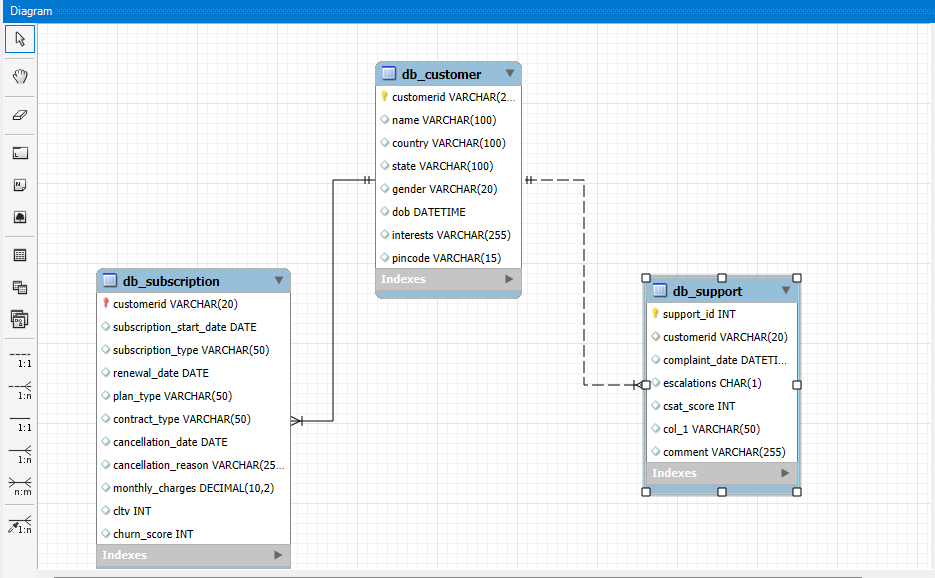

# Data Understanding

# 1. Database Overview

## 1.1 Introduction

The **customer_churn** database has been designed to support a comprehensive customer churn analysis for an Over-the-Top (OTT) video streaming platform. The primary objective of this database is to help the organization understand why customers discontinue their subscriptions, identify high-risk customer segments, and provide data-driven recommendations that improve customer retention and long-term business growth.

In today's highly competitive OTT industry, customer acquisition is expensive, while retaining existing subscribers is significantly more cost-effective. A small increase in customer retention can generate substantial improvements in recurring revenue, customer lifetime value, and overall business profitability. Therefore, understanding customer churn is considered a strategic business priority rather than simply a reporting exercise.

This database consolidates information from multiple business domains, including customer demographics, subscription history, and customer support interactions. By integrating these datasets into a single analytical database, analysts can evaluate customer behavior from multiple perspectives instead of relying on isolated operational reports.

---

## 1.2 Business Objective

The primary business objective of this database is to support evidence-based decision-making by identifying the key factors that influence customer churn.

More specifically, the database enables analysts to answer questions such as:

- Which customer segments are most likely to churn?
- Which subscription plans have the highest cancellation rates?
- Does customer support experience influence customer retention?
- Are annual subscribers more loyal than monthly subscribers?
- Which cancellation reasons occur most frequently?
- How do customer demographics affect subscription behavior?
- Which customers should be targeted by retention campaigns before they cancel?

The insights generated from these analyses will support multiple business departments, including Executive Management, Marketing, Finance, Product Management, and Customer Support.

---

## 1.3 Database Structure

The **customer_churn** database consists of three business-focused tables that represent different stages of the customer lifecycle.

| Table | Business Domain | Purpose |
|--------|-----------------|---------|
| **db_customer** | Customer Information | Stores customer demographic information and personal attributes. |
| **db_subscription** | Subscription Management | Stores subscription history, pricing, contract details, renewal information, cancellation records, and customer value metrics. |
| **db_support** | Customer Support | Stores customer complaints, support interactions, escalation history, satisfaction scores, and support comments. |

Each table represents a different aspect of the customer journey. When combined, these tables provide a complete view of customer behavior throughout the subscription lifecycle.

---

## 1.4 Analytical Perspective

From an analytical perspective, the database is designed to support cross-functional business analysis rather than simple transactional reporting.

Instead of analyzing customer information, subscription activity, or support interactions independently, this database enables analysts to connect these business domains to uncover hidden patterns that contribute to customer churn.

For example, an analyst can investigate whether:

- Customers with multiple support escalations are more likely to cancel.
- Low Customer Satisfaction (CSAT) scores are associated with higher churn risk.
- Premium subscribers generate higher Customer Lifetime Value (CLTV) than Basic subscribers.
- Monthly contracts experience higher cancellation rates than Annual contracts.
- Certain demographic groups prefer specific subscription plans.
- Particular complaint categories are strongly associated with customer cancellation.

These relationships help transform raw operational data into actionable business insights.

---

## 1.5 Business Value

This database supports strategic decision-making across multiple departments within the organization.

### Executive Management
- Monitor customer retention performance.
- Understand the overall drivers of customer churn.
- Evaluate the financial impact of customer cancellations.

### Marketing Department
- Identify customer segments suitable for retention campaigns.
- Evaluate acquisition channels and customer quality.
- Improve customer targeting strategies.

### Finance Department
- Analyze Customer Lifetime Value (CLTV).
- Estimate potential revenue loss due to churn.
- Support annual budgeting and revenue forecasting.

### Product Department
- Evaluate subscription plan performance.
- Identify product improvements based on cancellation behavior.
- Support pricing and subscription strategy decisions.

### Customer Support Department
- Measure the impact of customer support quality on retention.
- Prioritize complaint categories with the greatest business impact.
- Identify early warning signals for proactive customer intervention.

---

## 1.6 Why This Database Matters

Customer churn is rarely caused by a single factor. It is usually influenced by a combination of demographic characteristics, subscription preferences, pricing, customer experience, and service quality.

The customer_churn database has been structured to capture these different dimensions within a unified analytical environment. This enables analysts to move beyond descriptive reporting and perform diagnostic analysis that explains *why* customers churn and *which* customers are most at risk.

The insights generated from this database will ultimately support evidence-based business decisions aimed at improving customer retention, increasing customer lifetime value, optimizing subscription offerings, and strengthening long-term profitability.

---

## 1.7 Summary

The **customer_churn** database serves as the analytical foundation for this Customer Churn Analytics project. By integrating customer demographics, subscription information, and customer support interactions, the database provides a holistic view of the customer lifecycle. This integrated design enables analysts to identify churn drivers, evaluate customer behavior, measure business performance, and generate actionable recommendations that support strategic decision-making across the organization.
## 2. Database Schema

# 2. Database Schema

## 2.1 Overview

The **customer_churn** database follows a simple relational database design consisting of three interconnected tables. Each table represents a different business domain within the customer lifecycle, allowing analysts to combine customer demographics, subscription history, and customer support interactions into a single analytical model.

The database has been designed using a relational approach to ensure data consistency, minimize redundancy, and support efficient analytical queries. Rather than storing all information in a single table, the data is organized into logical entities that represent real-world business processes.

---

## 2.2 Database Architecture

The database consists of the following three tables:

| Table | Table Type | Business Domain |
|--------|------------|-----------------|
| **db_customer** | Dimension Table | Customer Demographics |
| **db_subscription** | Fact Table | Subscription Lifecycle |
| **db_support** | Transaction Table | Customer Support Activities |

Each table stores a different category of business information while remaining connected through a common identifier (**customerid**).

---

## 2.3 Primary Keys

A Primary Key uniquely identifies each record within a table.

| Table | Primary Key |
|--------|-------------|
| db_customer | customerid |
| db_subscription | customerid *(One subscription record per customer in this project)* |
| db_support | support_id *(or Ticket ID if available)* |

The **customerid** field acts as the primary business identifier throughout the database and enables relationships between multiple business domains.


---

## 2.4 Foreign Keys

Foreign Keys establish relationships between tables.

| Child Table | Foreign Key | Parent Table |
|--------------|-------------|--------------|
| db_subscription | customerid | db_customer |
| db_support | customerid | db_customer |

These relationships ensure that every subscription record and every support interaction belongs to a valid customer.

---

## 2.5 Relationship Structure

The database follows the relationships below:

```text
db_customer
      │
      ├──────────────┐
      │              │
      ▼              ▼
db_subscription   db_support
```

Relationship Details:

- One customer has one subscription record.
- One customer can have multiple support interactions.
- Every support ticket belongs to a single customer.
- Subscription information is connected directly to customer information.
- Support data can be combined with subscription data to analyze customer experience and churn behavior.

---

## 2.6 Data Flow

The database represents the complete customer lifecycle from acquisition to retention or cancellation.

```text
Customer Registration
          │
          ▼
Customer Profile Created
(db_customer)
          │
          ▼
Subscription Purchased
(db_subscription)
          │
          ▼
Customer Uses Service
          │
          ▼
Support Interaction (Optional)
(db_support)
          │
          ▼
Renew Subscription
        OR
Cancel Subscription
```

This lifecycle enables analysts to understand how customer characteristics, subscription behavior, and support experiences collectively influence churn.

---

## 2.7 Schema Design Rationale

The schema has been designed according to relational database principles commonly used in analytical systems.

### Separation of Business Domains

Instead of storing all customer information in a single table, the data is divided into logical business entities.

- **db_customer** stores relatively stable demographic information.
- **db_subscription** stores subscription lifecycle and commercial information.
- **db_support** stores operational customer service interactions.

This separation improves data organization, reduces redundancy, and simplifies maintenance.

### Common Business Identifier

The **customerid** column serves as the common business key across all tables.

This allows analysts to perform joins efficiently while maintaining referential integrity throughout the database.

### Analytical Flexibility

The schema supports both descriptive and diagnostic analytics.

For example, analysts can combine customer demographics, subscription details, and support history to investigate questions such as:

- Do customers with multiple support tickets have higher churn scores?
- Which subscription plans generate the highest Customer Lifetime Value (CLTV)?
- Does customer satisfaction influence subscription renewal?
- Are certain demographic segments more likely to cancel?

---

## 2.8 Benefits of the Database Schema

This relational schema provides several business and technical advantages.

### Business Benefits

- Provides a complete view of the customer lifecycle.
- Enables cross-functional business analysis.
- Supports evidence-based decision making.
- Facilitates churn analysis across multiple business dimensions.

### Technical Benefits

- Reduces data redundancy.
- Improves data consistency.
- Simplifies SQL joins.
- Supports scalable reporting and dashboard development.
- Enables efficient integration with Python and Power BI.

---

## 2.9 Summary

The **customer_churn** database follows a clean relational schema that connects customer information, subscription history, and customer support interactions through a shared business identifier. This design provides a strong analytical foundation for customer churn analysis and enables the organization to perform multidimensional analysis across customer demographics, subscription behavior, and service experience.

## 3. Entity Relationship

## Database Relationship

The database follows a relational design where **db_customer** acts as the parent entity.

Each customer has one subscription record stored in **db_subscription**, while a customer may create multiple support tickets throughout their subscription lifecycle.

This design enables analysts to combine demographic information, subscription behavior, and customer support interactions to perform multidimensional customer churn analysis.

Relationship Summary:

- db_customer (1) → (1) db_subscription
- db_customer (1) → (Many) db_support


## Entity Relationship Diagram



# 4. Table Overview

This section provides a high-level overview of each table within the **customer_churn** database. Each table represents a specific business domain and contributes unique information required for customer churn analysis. Together, these tables create a complete analytical view of the customer lifecycle, enabling the organization to understand customer behavior, subscription patterns, and support experiences.

---

## 4.1 db_customer

### Purpose

The **db_customer** table stores the demographic and personal profile information of each customer. It serves as the master customer table and acts as the parent entity for the entire database. Every customer is uniquely identified by a **customerid**, which is used to establish relationships with other business tables.

Customer demographic information changes infrequently compared to subscription or support data. Therefore, this table provides a stable foundation for customer segmentation and behavioral analysis.

### Business Importance

Understanding customer demographics is essential for identifying which customer groups are more likely to subscribe, remain loyal, or churn. Business teams frequently use this information to perform market segmentation, audience analysis, and personalized marketing campaigns.

The demographic attributes also help analysts discover whether customer characteristics such as age, gender, location, or content preferences influence subscription behavior.

### Key Business Information

The table contains customer profile information including:

- Customer Identifier
- Customer Name
- Country
- State
- Gender
- Date of Birth
- Preferred Content Interests
- Postal Code

### Primary Key

**customerid**

### Relationships

- Parent table of the database.
- One customer has one subscription record.
- One customer may have multiple support interactions.

### Business Questions Supported

Examples of business questions that can be answered using this table include:

- Which countries have the highest churn rate?
- Does customer age influence subscription preferences?
- Which content categories are most popular among loyal customers?
- Are customers from certain regions more likely to cancel subscriptions?
- Which demographic segments generate the highest Customer Lifetime Value (CLTV)?

---

## 4.2 db_subscription

### Purpose

The **db_subscription** table contains the complete subscription lifecycle of each customer. It is the primary analytical table for this project because it stores the commercial information required to measure customer retention, revenue, and churn.

This table records when a customer subscribed, the type of subscription they selected, pricing details, contract duration, renewal dates, cancellation information, Customer Lifetime Value (CLTV), and churn score.

### Business Importance

Most business decisions related to customer churn originate from this table. It provides the core metrics used to evaluate customer value, subscription performance, pricing effectiveness, and cancellation behavior.

Since this table contains revenue-related attributes, it is frequently used by Finance, Marketing, Product Management, and Executive Leadership to evaluate overall business performance.

### Key Business Information

The table stores information related to:

- Subscription Start Date
- Acquisition Channel
- Renewal Date
- Subscription Plan
- Contract Type
- Cancellation Date
- Cancellation Reason
- Monthly Charges
- Customer Lifetime Value (CLTV)
- Churn Score

### Primary Key

**customerid**

### Relationships

- Linked to **db_customer** through **customerid**.
- Can be joined with **db_support** to analyze how customer support influences subscription retention.

### Business Questions Supported

Examples include:

- Which subscription plan has the highest churn rate?
- Are Annual contracts more successful than Monthly contracts?
- Which acquisition channel produces the most valuable customers?
- What are the most common cancellation reasons?
- Which customers generate the highest lifetime value?
- Is there a relationship between CLTV and churn score?

---

## 4.3 db_support

### Purpose

The **db_support** table stores customer support interactions and complaint history. Unlike the customer and subscription tables, this table captures operational events that occur after customers begin using the service.

Each support record represents a customer interaction with the support team, including complaint details, escalation status, customer satisfaction score (CSAT), complaint category, and customer comments.

A single customer may generate multiple support records over time, allowing analysts to evaluate how service quality influences customer retention.

### Business Importance

Customer support is often one of the strongest indicators of customer dissatisfaction. By analyzing complaint history and support performance, the business can identify early warning signs of churn and implement proactive retention strategies.

This table also helps measure the effectiveness of the support team and identify recurring operational issues affecting customer experience.

### Key Business Information

The table contains:

- Support Ticket Identifier
- Customer Identifier
- Complaint Date
- Escalation Status
- Customer Satisfaction Score (CSAT)
- Complaint Category
- Customer Comment

### Primary Key

**support_id**

### Relationships

- Linked to **db_customer** using **customerid**.
- Multiple support records may exist for a single customer.
- Can be joined with **db_subscription** to measure the relationship between support quality and customer churn.

### Business Questions Supported

Examples include:

- Do customers with multiple complaints churn more frequently?
- Does low CSAT increase churn risk?
- Which complaint categories generate the most escalations?
- Which support issues have the greatest business impact?
- Are Premium customers receiving higher satisfaction scores?
- How does escalation affect customer retention?

---

### Summary

Each table within the **customer_churn** database represents a different stage of the customer lifecycle.

- **db_customer** explains **who the customer is**.
- **db_subscription** explains **how the customer subscribes and generates business value**.
- **db_support** explains **how the customer interacts with the support team after subscribing**.

Individually, each table provides valuable business information. When combined through relational joins, they create a comprehensive analytical dataset that enables multidimensional customer churn analysis and supports evidence-based business decision-making.


# 5. Data Dictionary

## Introduction

A **Data Dictionary** is a centralized documentation that provides a detailed description of every data element stored within the database. It serves as a common reference for business stakeholders, data analysts, data engineers, business intelligence developers, and other project team members by explaining the purpose, meaning, and analytical usage of each column.

Rather than simply listing column names and data types, a data dictionary establishes a shared understanding of how each attribute contributes to business operations and analytical objectives. It reduces ambiguity, improves communication between technical and non-technical teams, and ensures that analytical results are interpreted consistently across the organization.

For this Customer Churn Analytics project, the data dictionary has been developed to document the business meaning of every attribute across the three core business tables. In addition to technical metadata, each column is described from a business perspective, explaining why the information is collected, how it supports decision-making, and how it will be used throughout the analytical process.

Each attribute within the data dictionary includes the following information:

| Attribute | Description |
|-----------|-------------|
| **Column Name** | The physical name of the column stored in the database. |
| **Data Type** | The MySQL data type assigned to the column. |
| **Business Description** | Explains what the attribute represents from a business perspective. |
| **Business Purpose** | Describes why the organization collects and stores this information. |
| **Example Values** | Provides representative sample values stored within the column. |
| **Data Quality Considerations** | Identifies potential data quality issues that may require cleaning or validation before analysis. |
| **Analysis Usage** | Explains how the attribute will be used during exploratory analysis, business reporting, dashboard development, or predictive modeling. |

The data dictionary is organized by table to improve readability and maintainability. Each table is documented independently, allowing analysts to quickly understand the purpose and analytical value of every attribute before performing data exploration, cleaning, or business analysis.

The following sections describe the complete metadata for each table within the **customer_churn** database.

---


## 5.1 db_customer Data Dictionary

The **db_customer** table stores the demographic and profile information of customers. It serves as the master customer table within the **customer_churn** database and provides the foundational information required for customer segmentation, demographic analysis, and behavioral analytics. Every customer is uniquely identified using **customerid**, which establishes relationships with the subscription and support tables.

The following table describes each attribute contained in the **db_customer** table.

| Column Name | Data Type | Business Description | Business Purpose | Example Values | Data Quality Considerations | Analysis Usage |
|-------------|-----------|----------------------|------------------|----------------|-----------------------------|----------------|
| **customerid** | VARCHAR(20) | Unique identifier assigned to every customer. | Uniquely identifies customers and establishes relationships across all business tables. | CUST-0001, CUST-0158 | Must be unique, non-null, and follow the standard ID format. Duplicate or missing IDs break table relationships. | Used for SQL joins, customer-level analysis, segmentation, churn analysis, and dashboard filtering. |
| **name** | VARCHAR(100) | Full name of the customer. | Identifies individual customers for operational purposes. Although names are rarely used in analytical calculations, they improve readability in reports and customer service operations. | Omar Hasan, Priya Sharma | May contain spelling mistakes, inconsistent capitalization, or duplicate names. Names should never be treated as unique identifiers. | Mainly used in operational reports and customer lookup. Limited use in analytical models. |
| **country** | VARCHAR(50) | Country where the customer resides. | Enables geographical analysis and supports market-level performance evaluation. | Bangladesh, India, Nepal | May contain inconsistent spellings (e.g., Bangladesh, bangladesh, BD). Requires standardization during data cleaning. | Used to compare churn rates, customer distribution, revenue, and subscription performance across countries. |
| **state** | VARCHAR(100) | State, province, or administrative region of the customer. | Supports regional analysis and helps identify local customer behavior patterns. | Dhaka, Chattogram, Delhi, Tamil Nadu | May contain spelling errors, abbreviations, inconsistent naming conventions, or missing values. | Used for regional segmentation, churn comparison, and geographic dashboard visualizations. |
| **gender** | VARCHAR(20) | Self-reported or recorded gender of the customer. | Supports demographic segmentation and customer behavior analysis. | Male, Female | May contain inconsistent values such as M, F, Men, Women, Unknown, or blanks. Requires standardization before analysis. | Used to analyze customer demographics, subscription preferences, and churn patterns by gender. |
| **dob** | DATE | Customer's date of birth. | Used to calculate customer age and generate age-based business insights. | 1995-04-18 | Future dates, invalid dates, or missing values should be validated during data cleaning. | Used to calculate age groups, customer cohorts, and analyze churn behavior across different age segments. |
| **interests** | VARCHAR(255) | Preferred content categories selected or frequently watched by the customer. | Helps understand customer entertainment preferences and supports personalized content recommendations. | Action, Comedy, Drama, Sports | Multiple values may exist within a single field. Missing values are common. May require parsing if multiple genres are stored together. | Used to identify content preferences, recommend personalized content, and analyze relationships between viewing interests and customer retention. |
| **pincode** | VARCHAR(20) | Postal or ZIP code representing the customer's residential location. | Supports location-level customer analysis and geographic mapping when required. | 1216, 560001 | Missing values, incorrect lengths, or non-standard formats may exist depending on the country. | Used for geographic segmentation, regional reporting, and future location-based business analysis if required. |

### Business Importance

The **db_customer** table provides the demographic foundation for the entire analytical project. While it does not directly indicate whether a customer will churn, it supplies the contextual information required to understand **who the customer is**.

By combining this table with subscription and support data, analysts can investigate whether customer demographics influence subscription behavior, customer satisfaction, or churn probability.

### Key Analytical Applications

The **db_customer** table enables analysts to answer business questions such as:

- Which countries generate the highest customer lifetime value (CLTV)?
- Which regions experience the highest churn rates?
- Are younger customers more likely to subscribe to Premium plans?
- Does gender influence subscription preferences?
- Which customer segments should be prioritized for retention campaigns?
- Do customers with specific content interests demonstrate higher long-term loyalty?

The insights generated from this table support customer segmentation, market analysis, targeted marketing campaigns, and strategic business decision-making.

## 5.2 db_subscription Data Dictionary

The **db_subscription** table is the core analytical table of the **customer_churn** database. It records each customer's subscription lifecycle, including acquisition channel, subscription plan, contract type, pricing, renewal history, cancellation details, Customer Lifetime Value (CLTV), and churn score.

Unlike the **db_customer** table, which describes **who the customer is**, this table explains **how the customer interacts with the business**. Most business questions related to customer retention, revenue, subscription performance, and churn prediction are answered using this table.

The following table documents each attribute within the **db_subscription** table.

| Column Name | Data Type | Business Description | Business Purpose | Example Values | Data Quality Considerations | Analysis Usage |
|-------------|-----------|----------------------|------------------|----------------|-----------------------------|----------------|
| **customerid** | VARCHAR(20) | Unique identifier linking the subscription record to a customer. | Establishes the relationship between subscription data and customer demographics. | CUST-0001 | Must exist in **db_customer** and remain unique within this table. Missing or invalid IDs break relational integrity. | Used for SQL joins, customer-level analysis, and combining subscription data with demographic and support information. |
| **subscription_start_date** | DATE | Date on which the customer first subscribed to the OTT platform. | Measures customer tenure and subscription history. | 2023-05-15 | Missing or future dates should be validated. | Used to calculate customer tenure, cohort analysis, retention trends, and subscription growth over time. |
| **subscription_type** | VARCHAR(30) | Acquisition channel through which the customer joined the platform. | Helps evaluate the effectiveness of different customer acquisition strategies. | Organic, Paid, Referral | Inconsistent spellings such as REFERRAL, referral, Paid, paid should be standardized. | Used to compare customer quality, acquisition performance, CLTV, and churn across different marketing channels. |
| **renewal_date** | DATE | Scheduled renewal date of the customer's subscription. | Tracks subscription renewal behavior and contract lifecycle. | 2024-08-15 | Missing values should be investigated, especially for active subscriptions. | Used to identify upcoming renewals, renewal success rates, and customer retention trends. |
| **plan_type** | VARCHAR(30) | Subscription package selected by the customer. | Represents the service tier purchased by the customer. | Basic, Standard, Premium | Standardize inconsistent spellings and capitalization. | Used to compare revenue, customer distribution, churn rate, and CLTV across subscription plans. |
| **contract_type** | VARCHAR(20) | Billing commitment selected by the customer. | Indicates whether the customer subscribes on a Monthly or Annual basis. | Monthly, Annual | Missing or inconsistent values should be standardized before analysis. | Used to evaluate customer loyalty, contract performance, renewal behavior, and churn differences between contract types. |
| **cancellation_date** | DATE | Date on which the customer terminated the subscription. | Records when customer churn occurred. | 2024-10-20 | Active customers typically have NULL values. Future dates should be validated. | Used to calculate churn rate, customer retention period, and monthly churn trends. |
| **cancellation_reason** | VARCHAR(100) | Primary reason provided by the customer for cancelling the subscription. | Helps the business understand why customers leave the platform. | Too Expensive, Switched to Competitor, Poor Streaming Quality | Missing values are expected for active customers. Similar reasons should be grouped into standardized categories. | Used for churn root-cause analysis, product improvement, pricing evaluation, and retention strategy development. |
| **monthly_charges** | DECIMAL(10,2) | Monthly subscription fee paid by the customer. | Represents recurring monthly revenue generated by the customer. | 7.99, 12.99, 19.99 | Negative or unrealistic values should be investigated. | Used for revenue analysis, pricing strategy evaluation, ARPU calculation, and financial reporting. |
| **cltv** | DECIMAL(10,2) | Estimated Customer Lifetime Value generated by the customer throughout the relationship. | Measures the long-term financial value of each customer. | 250, 980, 2450 | Extremely high or low values should be validated. | Used for customer segmentation, profitability analysis, retention prioritization, and marketing ROI evaluation. |
| **churn_score** | INT | Numerical score representing the estimated likelihood that a customer will churn. Higher scores indicate greater churn risk. | Enables the business to proactively identify high-risk customers before cancellation occurs. | 15, 48, 87, 96 | Values should remain within the defined scoring range (typically 0–100). | Used to identify high-risk customers, build predictive models, prioritize retention campaigns, and monitor churn trends. |

---

### Business Importance

The **db_subscription** table is the primary source of commercial and behavioral information within the project. It enables the organization to measure customer acquisition, subscription performance, contract effectiveness, pricing strategy, revenue generation, and customer retention.

Business teams including **Marketing**, **Finance**, **Product Management**, and **Executive Leadership** rely heavily on this table to evaluate business performance and identify opportunities to reduce customer churn.

---

### Key Analytical Applications

The **db_subscription** table enables analysts to answer questions such as:

- Which subscription plan has the highest churn rate?
- Do Annual subscribers remain loyal longer than Monthly subscribers?
- Which acquisition channel generates customers with the highest CLTV?
- What are the most common cancellation reasons?
- Does higher monthly pricing increase churn risk?
- Which customer segments generate the greatest long-term revenue?
- How does churn score vary across plans, countries, and customer demographics?
- Which customers should be prioritized for proactive retention campaigns?

The insights generated from this table directly support pricing optimization, customer retention strategies, revenue forecasting, marketing investment decisions, and executive-level business planning.

## 5.3 db_support Data Dictionary

The **db_support** table captures customer support interactions throughout the customer's subscription journey. Each record represents a support ticket or complaint raised by a customer, along with details about the issue, escalation status, customer satisfaction (CSAT), complaint category, and customer feedback.

Unlike the **db_customer** table, which describes customer demographics, and the **db_subscription** table, which captures commercial information, the **db_support** table reflects the customer's service experience after subscribing to the platform.

Support interactions often serve as early warning signals of customer dissatisfaction. By analyzing complaint history, escalation frequency, and customer satisfaction, the organization can proactively identify customers at high risk of churn and implement targeted retention strategies.

The following table documents each attribute within the **db_support** table.

| Column Name | Data Type | Business Description | Business Purpose | Example Values | Data Quality Considerations | Analysis Usage |
|-------------|-----------|----------------------|------------------|----------------|-----------------------------|----------------|
| **support_id** | INT | Unique identifier assigned to each customer support interaction. | Ensures every support ticket can be uniquely tracked and referenced. | 1, 205, 1568 | Must be unique and non-null. Duplicate IDs indicate data integrity issues. | Used to uniquely identify support records and calculate ticket volume. |
| **customerid** | VARCHAR(20) | Customer who submitted the support request. | Links support activity with customer demographics and subscription information. | CUST-0042 | Must exist in **db_customer**. Invalid or missing values break table relationships. | Used for SQL joins, customer-level support analysis, and churn investigation. |
| **complaint_date** | DATE | Date when the customer contacted the support team. | Tracks the timeline of customer issues and service interactions. | 2024-02-14 | Missing or future dates should be validated. | Used to analyze complaint trends, seasonal issues, and time between complaint and churn. |
| **escalations** | TINYINT (0/1) | Indicates whether the support issue required escalation beyond the first-level support team. | Measures issue severity and support complexity. Escalated cases often require senior technical or managerial intervention. | 0, 1 | Values should only contain 0 or 1. Missing or unexpected values require validation. | Used to identify high-risk customers, evaluate support efficiency, and analyze whether escalated issues increase churn probability. |
| **csat_score** | TINYINT | Customer Satisfaction (CSAT) score provided after the support interaction. Typically measured on a scale from 1 (Very Dissatisfied) to 5 (Very Satisfied). | Measures customer satisfaction with the support experience and overall service quality. | 1, 2, 3, 4, 5 | Values should remain within the defined scoring range. Missing scores may occur when customers do not complete the survey. | Used to measure customer experience, identify dissatisfied customers, evaluate support performance, and analyze the relationship between satisfaction and churn. |
| **col_1 (Complaint Category)** | VARCHAR(50) | Business category representing the primary reason for contacting customer support. | Helps identify recurring operational problems affecting customer experience. | Streaming, Billing, Login, Payment, Content | Similar categories may appear with inconsistent naming and require standardization. | Used to identify the most common complaint types, prioritize operational improvements, and measure which issues contribute most to churn. |
| **comment** | TEXT | Free-text feedback describing the customer's issue or support experience. | Provides qualitative insights into customer frustrations, expectations, and service quality. | "Video buffers every evening", "Payment deducted twice" | May contain spelling mistakes, abbreviations, empty values, or inconsistent language. Text cleaning may be required before analysis. | Used for qualitative analysis, complaint theme identification, sentiment analysis, and understanding the root causes behind customer dissatisfaction. |

---

### Business Importance

The **db_support** table provides valuable operational insights into customer experience after subscription. While subscription data explains **what** happened, support data often explains **why** it happened.

Customers who repeatedly contact support, experience unresolved issues, or provide low satisfaction scores are generally at a higher risk of cancelling their subscriptions. As a result, this table enables the business to identify dissatisfaction before churn occurs and supports proactive customer retention initiatives.

The information stored within this table is particularly valuable for the **Customer Support**, **Product**, and **Customer Success** teams, helping them improve service quality, reduce complaint volume, and enhance the overall customer experience.

---

### Key Analytical Applications

The **db_support** table enables analysts to answer questions such as:

- Do customers with multiple support tickets have a higher churn rate?
- Does a low CSAT score increase the likelihood of customer churn?
- Which complaint categories generate the highest number of escalations?
- Which operational issues (Streaming, Billing, Login, etc.) contribute most to customer dissatisfaction?
- How long after a complaint does a customer typically cancel their subscription?
- Are Premium subscribers receiving better support experiences than Basic subscribers?
- Which complaint categories should be prioritized to improve customer retention?
- Can support interactions be used as an early warning indicator for churn prediction?

The insights generated from this table support customer experience improvement, operational optimization, support performance monitoring, proactive retention strategies, and predictive churn analytics.

## 6. Business Rules
# 6. Business Rules

## Introduction

Business Rules define the assumptions, constraints, and operational logic that govern how business data should be interpreted throughout the Customer Churn Analytics project. These rules establish a common understanding between business stakeholders and the analytics team, ensuring that reports, dashboards, and analytical findings are consistent, accurate, and aligned with business objectives.

The rules documented below are based on discussions with key stakeholders, including the CEO, Finance Manager, Product Manager, Marketing Manager, and Customer Support Manager. They represent the agreed business definitions and assumptions that will guide all subsequent data cleaning, analysis, and reporting activities.

---

## 6.1 Customer Identification

- Every customer is uniquely identified by **customerid**.
- A customer must exist in the **db_customer** table before appearing in the subscription or support tables.
- Customer IDs are considered permanent and should never change during the customer's lifecycle.

**Business Impact**

This rule ensures that customer information remains consistent across all business systems and allows analysts to accurately combine customer, subscription, and support data.

---

## 6.2 Subscription Lifecycle

- Each customer has one active subscription record in this project.
- The subscription begins on **subscription_start_date**.
- Customers renew their subscription on the **renewal_date** unless they cancel beforehand.
- A NULL **cancellation_date** indicates that the customer is currently active.

**Business Impact**

This rule allows analysts to distinguish between active and churned customers while calculating retention rates and customer tenure.

---

## 6.3 Churn Definition

For this project, a customer is considered **churned** if they cancel their subscription before the next renewal period.

Customers with a recorded **cancellation_date** are classified as churned customers.

Customers without a cancellation date are considered active customers.

**Business Impact**

Using a consistent churn definition ensures that all departments calculate churn metrics using the same business logic.

---

## 6.4 Customer Acquisition Channels

Customers may join the platform through one of the following acquisition channels:

- Organic
- Paid
- Referral

Each customer belongs to only one acquisition channel.

**Business Impact**

This enables Marketing to evaluate customer quality, campaign effectiveness, customer acquisition cost (CAC), and long-term customer value across different channels.

---

## 6.5 Subscription Plans

The platform currently offers three subscription plans:

- Basic
- Standard
- Premium

Each customer can subscribe to only one plan at a time.

**Business Impact**

This rule supports pricing analysis, plan performance evaluation, and customer segmentation.

---

## 6.6 Contract Types

Customers subscribe using one of the following contract types:

- Monthly
- Annual

Annual contracts are generally expected to have higher customer retention than Monthly contracts.

**Business Impact**

Comparing contract types helps identify which pricing strategy generates stronger customer loyalty and higher lifetime value.

---

## 6.7 Customer Lifetime Value (CLTV)

CLTV represents the estimated total business value generated by a customer throughout their relationship with the company.

A higher CLTV indicates a more valuable customer.

**Business Impact**

Customers with high CLTV should receive higher priority in retention campaigns because losing them results in greater revenue loss.

---

## 6.8 Churn Score

Churn Score represents the estimated likelihood that a customer will cancel their subscription.

- Lower score = Lower churn risk
- Higher score = Higher churn risk

**Business Impact**

Customers with high churn scores should be proactively targeted by retention initiatives before cancellation occurs.

---

## 6.9 Customer Support

Each support record represents one customer support interaction.

A customer may create multiple support tickets throughout their subscription lifecycle.

**Business Impact**

Multiple support interactions may indicate customer dissatisfaction and should be monitored as potential churn signals.

---

## 6.10 Escalation Rules

Escalation indicates whether a customer issue required intervention beyond the first-level support team.

- 0 = Resolved by first-line support
- 1 = Escalated to senior support

**Business Impact**

Escalated cases often represent more severe customer issues and may increase churn risk if not resolved promptly.

---

## 6.11 Customer Satisfaction (CSAT)

CSAT is measured on a scale from **1 to 5**.

| Score | Meaning |
|--------|---------|
| 1 | Very Dissatisfied |
| 2 | Dissatisfied |
| 3 | Neutral |
| 4 | Satisfied |
| 5 | Very Satisfied |

**Business Impact**

Lower CSAT scores indicate poor customer experience and may serve as an early warning indicator of future churn.

---

## 6.12 Complaint Categories

Customer complaints are grouped into business categories such as:

- Streaming
- Billing
- Login
- Payment
- Content

**Business Impact**

Analyzing complaint categories helps identify recurring operational issues and prioritize improvements that have the greatest impact on customer retention.

---

## 6.13 Missing Values

The following missing values are considered acceptable:

- NULL cancellation_date → Customer is Active.
- NULL cancellation_reason → Customer has not cancelled.
- NULL comment → Customer did not provide written feedback.
- NULL csat_score → Customer did not complete the satisfaction survey.

Any unexpected missing values in key identifiers (such as **customerid**) are considered data quality issues.

---

## 6.14 Data Quality Assumptions

Before analysis, the following assumptions should be validated:

- Customer IDs are unique.
- Subscription plans are standardized.
- Acquisition channels are standardized.
- Gender values are standardized.
- Country and state names are standardized.
- Date formats are valid.
- Duplicate records are removed.
- Invalid CSAT scores are corrected or excluded.

---

## 6.15 Business Rule Summary

These business rules establish the analytical foundation for the Customer Churn Analytics project. They ensure that all stakeholders interpret customer behavior, subscription activity, customer support interactions, and churn consistently throughout the project lifecycle.

By documenting these assumptions before analysis begins, the organization reduces ambiguity, improves data quality, and enables reliable business insights that support strategic decision-making.

## 6.16 Project Assumptions & Limitations

The business rules defined in this document are based on the scope and data available for this portfolio project. While they accurately support the analytical objectives of this case study, some assumptions differ from how a production-grade OTT platform would operate.

### Assumptions

- Each customer is assumed to have only one active subscription during the analysis period.
- The **customerid** uniquely identifies a customer across all tables.
- The **CLTV** values are assumed to be pre-calculated and provided by the business.
- The **Churn Score** is assumed to be generated by an existing business scoring model and is not calculated within this project.
- Customer support records accurately represent all reported issues and interactions.

### Project Limitation

In a real-world subscription business, customer churn is typically determined using **subscription renewal history and payment transactions**. A customer is often classified as churned only after failing to renew their subscription or complete a successful payment within a predefined grace period (e.g., 30 days after the renewal date).

However, the current project dataset does not contain payment transaction data. As a result, it is not possible to verify whether a customer successfully renewed their subscription after the scheduled renewal date.

Therefore, for the scope of this project, **customer churn is operationally defined using the `cancellation_date` field**:

- Customers with a valid **cancellation_date** are classified as **Churned**.
- Customers with a **NULL cancellation_date** are classified as **Active**.

This definition provides a consistent and reliable basis for analysis while acknowledging the limitations of the available dataset.

### Future Enhancement

If a **Payment Transactions** table becomes available in the future, the churn definition can be refined as follows:

> A customer will be classified as churned if no successful payment is received within **30 days after the scheduled renewal date**.

This approach would more accurately reflect the customer lifecycle used in modern subscription-based businesses and improve the reliability of churn measurement.

## 7. Expected Data Quality Issues

# 7. Expected Data Quality Issues

## 7.1 Introduction

Before performing any statistical analysis, visualization, or predictive modeling, it is essential to evaluate the quality of the available data. High-quality data is the foundation of reliable business insights, whereas poor-quality data can lead to misleading conclusions and incorrect business decisions.

Since this project simulates a real-world OTT (Over-the-Top) streaming platform, the dataset intentionally contains several inconsistencies, missing values, formatting issues, and data anomalies that commonly occur in production environments.

The objective of this section is to identify the expected data quality issues, assess their potential business impact, and define the cleaning strategy that will be applied before analysis begins.

The identified issues are categorized into the following areas:

- Missing Values
- Duplicate Records
- Inconsistent Formatting
- Invalid Values
- Referential Integrity Issues
- Outliers
- Data Type Issues
- Business Logic Validation

Each issue will be investigated during the Data Cleaning phase to ensure the dataset is suitable for business analysis.

---

## 7.2 Missing Values

Missing values are one of the most common data quality challenges in business databases. However, not every missing value represents an error. Some NULL values are expected and carry meaningful business information, while others indicate incomplete or poor-quality data.

### Expected Missing Values

The following NULL values are considered valid within the business context:

| Column | Reason |
|---------|--------|
| cancellation_date | Customer has not cancelled the subscription. |
| cancellation_reason | Applicable only for churned customers. |
| comment | Customer did not provide written feedback. |
| csat_score | Customer did not complete the satisfaction survey. |

These values should **not** be treated as data errors.

### Unexpected Missing Values

The following columns should never contain missing values:

- customerid
- subscription_start_date
- plan_type
- contract_type
- monthly_charges
- complaint_date (for support records)

Missing values in these fields may prevent accurate analysis and should be investigated before proceeding.

### Business Impact

Unexpected missing values can lead to:

- Incorrect customer segmentation
- Invalid revenue calculations
- Misleading churn analysis
- Broken relationships between tables
- Inaccurate business dashboards

### Planned Cleaning Strategy

- Identify missing values using SQL and Python.
- Classify missing values as **Business NULL** or **Data Quality Issue**.
- Remove or impute unexpected missing values based on business rules.
- Preserve business-valid NULL values.

---

## 7.3 Duplicate Records

Duplicate records occur when the same business entity is stored multiple times. Duplicate customer records can distort KPIs such as customer count, revenue, churn rate, and CLTV.

### Potential Duplicate Scenarios

- Duplicate customer IDs
- Duplicate subscription records
- Repeated support tickets
- Duplicate customer profiles

### Business Impact

Duplicate records may result in:

- Overestimated customer counts
- Incorrect churn percentages
- Inflated revenue
- Misleading customer lifetime value

### Planned Cleaning Strategy

- Identify duplicates using SQL.
- Verify duplicates against business rules.
- Remove only unintended duplicate records while preserving legitimate repeated support interactions.

---

## 7.4 Inconsistent Formatting

Business data collected from multiple systems often contains inconsistent text formatting.

Examples include:

- Bangladesh
- bangladesh
- BANGLADESH
- BD

Similarly,

- Male
- male
- M
- Men

represent the same business value.

### Business Impact

Inconsistent formatting leads to fragmented reporting and inaccurate aggregation.

For example,

"Bangladesh"

and

"bangladesh"

may appear as two separate countries in a dashboard.

### Planned Cleaning Strategy

- Standardize capitalization.
- Normalize categorical values.
- Create business mapping rules.
- Replace abbreviations with standardized values.
## 7.5 Invalid Values

Invalid values occur when data violates predefined business rules or contains information that is impossible, inconsistent, or outside the acceptable business range. These values can significantly impact analytical accuracy and business decision-making.

### Expected Invalid Values

The following issues are expected to exist within the dataset:

- Invalid gender values (e.g., `Male`, `male`, `M`, `Men`, `Unknown`)
- Inconsistent country names (`Bangladesh`, `bangladesh`, `BD`)
- Misspelled state names (`Dhakaa`, `Chattogram`, `Chittagong`)
- Negative or unrealistic monthly charges
- Invalid CSAT scores outside the range of 1–5
- Churn scores outside the expected range of 0–100
- Invalid subscription or contract types

### Business Impact

Invalid values can result in:

- Incorrect customer segmentation
- Misleading business reports
- Incorrect KPI calculations
- Reduced confidence in analytical findings

### Planned Cleaning Strategy

- Validate categorical values against predefined business lists.
- Correct spelling mistakes and inconsistent naming.
- Remove or flag invalid numerical values.
- Standardize all categorical variables before analysis.

---

## 7.6 Referential Integrity Issues

Since the database consists of multiple related tables, maintaining referential integrity is essential. Every subscription and support record should correspond to an existing customer.

### Expected Issues

Potential integrity issues include:

- Customer IDs present in **db_subscription** but missing from **db_customer**
- Customer IDs present in **db_support** but missing from **db_customer**
- Duplicate customer IDs
- Orphan records caused by missing parent records

### Business Impact

Broken relationships may cause:

- Incorrect JOIN results
- Missing customer information
- Inaccurate churn calculations
- Incorrect dashboard metrics

### Planned Cleaning Strategy

- Verify all foreign keys using SQL joins.
- Identify orphan records.
- Investigate unmatched customer IDs.
- Correct data inconsistencies before analysis.

---

## 7.7 Outliers

Outliers are observations that differ significantly from the majority of the dataset. While some outliers represent genuine high-value customers, others may indicate data entry errors.

### Potential Outliers

Possible outliers include:

- Extremely high CLTV values
- Unusually high monthly charges
- Very old or very young customer ages
- Customers with an unusually large number of support tickets
- Extremely high churn scores

### Business Impact

Outliers may:

- Distort averages and summary statistics
- Influence predictive models
- Mislead business decisions
- Hide meaningful customer patterns

### Planned Cleaning Strategy

- Identify outliers using statistical methods (IQR and Z-score where appropriate).
- Validate extreme observations against business rules.
- Retain legitimate business outliers.
- Remove only confirmed data errors.

---

## 7.8 Data Type Issues

Incorrect data types frequently occur when data is collected from multiple operational systems. Before analysis, every column must have the correct data type.

### Expected Issues

Possible data type problems include:

- Dates stored as text
- Numeric fields stored as strings
- Empty strings instead of NULL values
- Mixed numeric and text values
- Incorrect decimal precision

### Business Impact

Incorrect data types may:

- Prevent calculations
- Cause SQL errors
- Produce incorrect aggregations
- Break Power BI visualizations
- Affect Python analysis

### Planned Cleaning Strategy

- Convert dates into DATE format.
- Convert numerical columns into appropriate numeric data types.
- Replace empty strings with NULL values.
- Validate decimal precision.
- Standardize Boolean fields.

---

## 7.9 Business Logic Validation

Data may appear technically correct but still violate business rules. Therefore, business logic validation is required before analytical modeling begins.

### Validation Rules

The following business rules will be verified:

- Cancellation Date should not occur before Subscription Start Date.
- Renewal Date should occur after Subscription Start Date.
- Cancellation Reason should only exist for churned customers.
- Monthly Charges should always be greater than zero.
- CLTV should generally increase with longer customer tenure.
- CSAT scores must remain within the valid range.
- Escalation values should only contain 0 or 1.
- Churn Score should remain between 0 and 100.

### Business Impact

Business logic validation helps ensure:

- Reliable KPI calculations
- Trustworthy dashboards
- Accurate churn analysis
- Better predictive model performance

### Planned Validation Approach

Business rules will be validated using SQL queries, Python scripts, and manual verification where necessary.

---

## 7.10 Data Quality Summary

The quality of analytical insights depends directly on the quality of the underlying data. Before any exploratory analysis, dashboard development, or predictive modeling, a comprehensive data quality assessment will be conducted.

The primary objectives of the data cleaning process are to:

- Improve data completeness.
- Remove duplicate and inconsistent records.
- Standardize categorical values.
- Correct formatting and data type issues.
- Validate business rules.
- Preserve meaningful business information.
- Ensure referential integrity across all tables.

After completing the data cleaning phase, the dataset will be considered analysis-ready and suitable for Exploratory Data Analysis (EDA), SQL analytics, Power BI dashboard development, and Machine Learning-based churn prediction.

The completion of this phase ensures that all subsequent business insights are based on accurate, consistent, and trustworthy data, enabling stakeholders to make informed strategic decisions with confidence.

## 8. Initial Data Profiling Plan
# 8. Initial Data Profiling Plan

## 8.1 Introduction

Before performing data cleaning, exploratory analysis, or predictive modeling, it is essential to understand the current state of the dataset. Data Profiling is the process of systematically examining the structure, completeness, consistency, and quality of the available data.

The primary objective of this phase is to identify potential data quality issues, validate business assumptions, and ensure that the dataset is suitable for downstream analytical tasks.

This profiling activity will be performed using **MySQL** for database-level validation and **Python (Pandas)** for detailed statistical profiling.

The findings from this phase will directly guide the Data Cleaning and Exploratory Data Analysis (EDA) processes.

---

# 8.2 Data Profiling Objectives

The profiling process aims to answer the following business questions:

- Is the dataset complete?
- Are there missing values?
- Are duplicate records present?
- Are customer relationships valid across all tables?
- Are numerical values within acceptable business ranges?
- Are categorical values standardized?
- Are dates logically consistent?
- Which variables require cleaning before analysis?

The answers to these questions will determine the overall quality of the dataset.

---

# 8.3 Profiling Activities

The following profiling activities will be performed before data cleaning begins.

---

## Phase 1 — Database Structure Validation

Objective:

Understand the database structure and verify that all tables have been created correctly.

Activities:

- Review database schema
- Verify table relationships
- Check primary keys
- Check foreign key relationships
- Review column data types
- Verify table sizes

Tools

- MySQL

Expected Output

- Database validation report

---

## Phase 2 — Data Completeness Assessment

Objective

Measure the completeness of each table.

Activities

- Count total records
- Count NULL values
- Calculate missing value percentage
- Identify columns with excessive missing values

Tools

- SQL
- Python (Pandas)

Expected Output

- Missing Value Report

---

## Phase 3 — Duplicate Detection

Objective

Identify duplicate business records.

Activities

- Duplicate customer IDs
- Duplicate subscription records
- Duplicate support tickets
- Duplicate customer profiles

Tools

- SQL
- Python

Expected Output

- Duplicate Analysis Report

---

## Phase 4 — Categorical Data Assessment

Objective

Evaluate the quality of categorical variables.

Activities

Review unique values for:

- Country
- State
- Gender
- Plan Type
- Contract Type
- Subscription Type
- Complaint Category

Identify

- Misspellings
- Mixed capitalization
- Business synonyms
- Invalid categories

Example

Instead of

Bangladesh

bangladesh

BD

The data should become

Bangladesh

Expected Output

- Category Standardization Report

---

## Phase 5 — Numerical Data Assessment

Objective

Validate all numerical business metrics.

Columns

- Monthly Charges
- CLTV
- Churn Score
- CSAT Score

Activities

- Minimum value
- Maximum value
- Mean
- Median
- Standard deviation
- Outlier detection

Expected Output

- Numerical Summary Report

---

## Phase 6 — Date Validation

Objective

Validate all business dates.

Activities

Check

- Subscription Start Date
- Renewal Date
- Cancellation Date
- Complaint Date

Business Validation

- Renewal Date > Subscription Date
- Cancellation Date > Subscription Date
- Complaint Date within customer lifecycle

Expected Output

- Date Validation Report

---

## Phase 7 — Referential Integrity Assessment

Objective

Ensure all relationships are valid.

Activities

Verify

Every Subscription Customer

↓

Exists in Customer Table

Every Support Customer

↓

Exists in Customer Table

Identify

- Missing Customer IDs
- Orphan Records
- Invalid Relationships

Expected Output

- Relationship Validation Report

---

## Phase 8 — Business Rule Validation

Objective

Validate business assumptions.

Business Rules

- Monthly Charges > 0
- Churn Score between 0–100
- CSAT Score between 1–5
- Escalation values = 0 or 1
- Cancellation Reason only for churned customers

Expected Output

- Business Rule Validation Report

---

## Phase 9 — Initial Business Profiling

Before cleaning begins, several high-level business summaries will be produced to better understand the customer base.

These include:

Customer Distribution

- Country
- State
- Gender

Subscription Distribution

- Plan Type
- Contract Type
- Acquisition Channel

Customer Value

- Average CLTV
- Average Monthly Charges

Support Performance

- Average CSAT
- Escalation Rate
- Complaint Category Distribution

Expected Output

- Business Profiling Dashboard

---

# 8.4 Deliverables

At the end of the profiling phase, the following reports will be available:

- Database Validation Report
- Missing Value Report
- Duplicate Analysis Report
- Category Standardization Report
- Numerical Statistics Report
- Date Validation Report
- Relationship Validation Report
- Business Rule Validation Report
- Initial Business Summary Report

These reports will serve as the foundation for the Data Cleaning phase.

---

# 8.5 Summary

Data Profiling is the first analytical step after database creation. Rather than immediately performing analysis, the dataset must first be evaluated to ensure that it accurately represents business operations.

The profiling activities described in this section provide a structured framework for assessing data quality, validating business assumptions, and identifying potential issues before cleaning begins.

By completing this phase, the analytics team will gain a comprehensive understanding of the dataset, enabling efficient data cleaning and ensuring that subsequent SQL analysis, Python-based EDA, Power BI dashboards, and Machine Learning models are built on reliable and trustworthy data.

This approach reflects industry best practices and establishes a strong foundation for data-driven decision-making throughout the Customer Churn Analytics project.

## 9. Summary

# 9. Summary

The **Customer Churn Analytics** project begins with a structured understanding of the available business data before any analytical work is performed. Rather than immediately conducting SQL queries or building dashboards, this document establishes the business context, data architecture, and analytical foundation required for reliable decision-making.

The project database consists of three interconnected tables—**db_customer**, **db_subscription**, and **db_support**—which collectively capture customer demographics, subscription behavior, and customer support interactions. Together, these datasets provide a comprehensive view of the customer lifecycle, enabling the organization to analyze not only *who* the customers are, but also *how* they interact with the platform and *why* they may decide to leave.

Throughout this document, the database schema, entity relationships, table structures, and detailed data dictionaries have been documented to ensure that every data attribute is interpreted consistently across business and technical teams. Business rules have also been defined to establish a common understanding of customer churn, subscription lifecycle, customer lifetime value (CLTV), customer satisfaction (CSAT), and support escalation processes.

Recognizing that real-world business data is rarely perfect, this document identifies the expected data quality challenges, including missing values, duplicate records, inconsistent formatting, invalid values, referential integrity issues, and business logic violations. A structured data profiling strategy has been proposed to systematically evaluate these issues before the data cleaning process begins.

The Initial Data Profiling Plan outlines a comprehensive framework for assessing data completeness, consistency, validity, and integrity using both **MySQL** and **Python (Pandas)**. The results of this phase will guide subsequent data cleaning activities and ensure that all analytical outputs are built on accurate and trustworthy data.

By completing this Data Understanding phase, the project establishes a strong analytical foundation for the remaining stages of the Customer Churn Analytics lifecycle. The next phases will focus on SQL-based data profiling, Python-driven data cleaning, exploratory data analysis (EDA), business insight generation, dashboard development in Power BI, and executive-level recommendations.

Ultimately, the objective of this project is not only to identify customers who are at risk of churning, but also to uncover the business drivers behind customer attrition and provide actionable recommendations that improve customer retention, increase customer lifetime value, and support long-term business growth.

This document follows industry best practices for analytics project documentation and serves as the foundation for all subsequent technical and business analyses within the Customer Churn Analytics project.